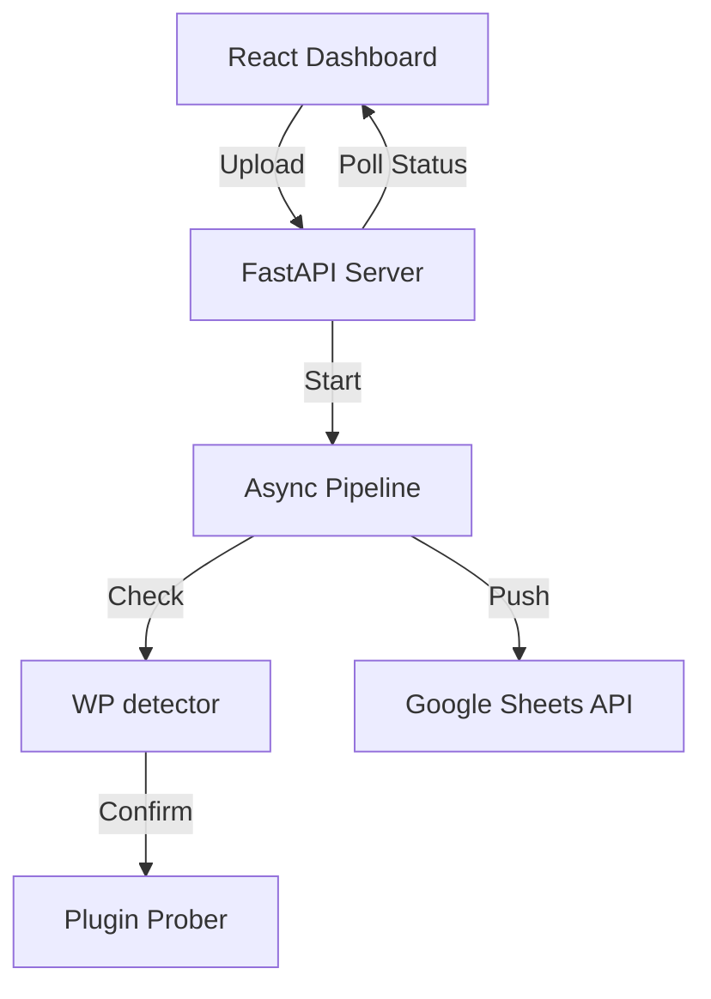

# WP Plugin Hunter 🎯

A high-performance, asynchronous WordPress plugin detection and vulnerability scanner with a modern web interface and live Google Sheets reporting.


## ✨ Features

- **🚀 High Concurrency**: Built with Python `asyncio` and `aiohttp` to scan thousands of domains in minutes.
- **💎 Premium UI**: Modern React dashboard with real-time progress bars, hit counters, and dark-mode aesthetics.
- **📊 Live Sheet Sync**: Automatically creates a new tab for every scan and pushes results live to Google Sheets.
- **🔍 Smart Detection**: Multi-tiered strategy (lightweight headers check -> targeted file probing).
- **📦 Zero Config Startup**: Comes with a one-click `run.bat` script for easy setup.

## 🛠️ Architecture



## 🚀 Quick Start (Windows)

1.  **Clone the repository**:
    ```bash
    git clone https://github.com/your-username/wp-plugin-hunter.git
    cd wp-plugin-hunter
    ```
2.  **Add your Google Sheets Credentials**:
    - Place your Service Account JSON file in the root directory.
    - Update the `.env` file with your `GOOGLE_SHEET_ID` and the filename of your JSON.
    - > [!CAUTION]
      > **Security Warning**: Large projects usually ignore `.env` and JSON keys. I have added a `.gitignore` to prevent you from accidentally pushing these to GitHub. **Never share your service account JSON publicly.**
3.  **Run the script**:
    - Simply double-click `run.bat`. It will automatically set up a virtual environment, install requirements, and start the server.
4.  **Open Browser**:
    - Visit `http://localhost:8000`.

## ⚙️ Configuration

Create a `.env` file in the root directory:

```env
GOOGLE_SHEETS_JSON=your-service-account.json
GOOGLE_SHEET_ID=your-google-sheet-id-from-url
```

## 📦 Packaging as EXE

To create a standalone executable for distribution:
```bash
python package.py
```
The result will be in the `dist/` folder.

## 🤝 Contribution

Feel free to fork this project and submit PRs for any new detector strategies or UI improvements!
